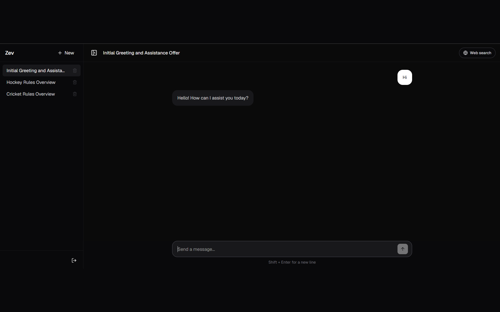
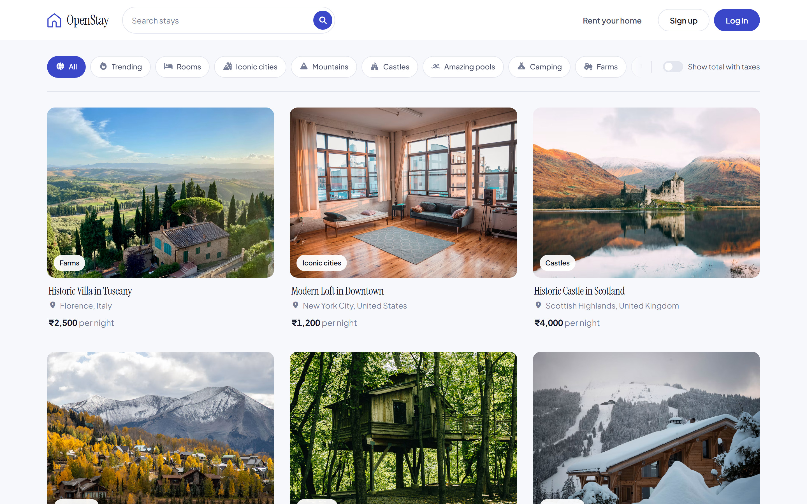
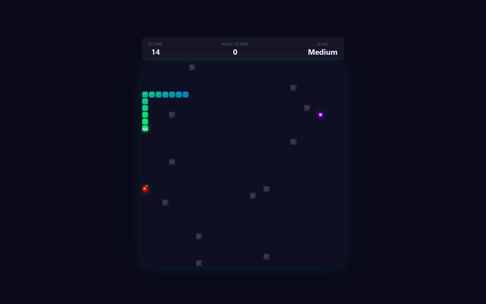
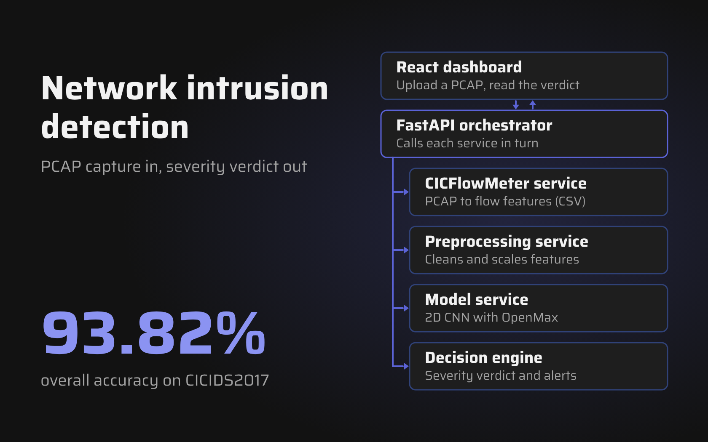

<h1 align="center">Hi, I'm Anurag Kumar</h1>

  

  
  
  

## About

- B.Tech in Computer Science at **KIIT**, Bhubaneswar (2023 – 2027), CGPA 8.73
- Software Developer Intern at **AntBox**: backend features in FastAPI and PostgreSQL, observability with Sentry and OpenTelemetry, and marketing pages in Next.js
- I build web apps end to end: React and Next.js front ends, Python and Node.js back ends, and the databases behind them
- Google Cloud Fundamentals: Core Infrastructure certified

## Tech stack

**Languages** 

**Frontend** 

**Backend** 

**Cloud, databases & tools** 
 
Also: Google Cloud Run, BigQuery, Cloud Storage, Neon, Groq SDK

## Projects

<table>
  <tr>
    <td width="50%" valign="top">
      
      <h3>Zev</h3>
      
An AI chatbot with streaming replies, cited web search and saved chats.

      

        
        
        
        
      

      
<a href="https://zev-ten.vercel.app">Live</a> · <a href="https://github.com/Anurag-2312/Zev">Code</a> · <a href="https://anuragkumar-dev.vercel.app/projects/zev">Details</a>

    </td>
    <td width="50%" valign="top">
      
      <h3>OpenStay</h3>
      
A vacation-rental web app with photo uploads, maps and reviews.

      

        
        
        
        
      

      
<a href="https://openstay-74td.onrender.com/listings">Live</a> · <a href="https://github.com/Anurag-2312/OpenStay">Code</a> · <a href="https://anuragkumar-dev.vercel.app/projects/openstay">Details</a>

    </td>
  </tr>
  <tr>
    <td width="50%" valign="top">
      
      <h3>BiteSnake</h3>
      
Snake for the browser, with special fruits, obstacles and a global leaderboard.

      

        
        
        
      

      
<a href="https://bite-snake.vercel.app">Live</a> · <a href="https://github.com/Anurag-2312/BiteSnake">Code</a> · <a href="https://anuragkumar-dev.vercel.app/projects/bitesnake">Details</a>

    </td>
    <td width="50%" valign="top">
      
      <h3>NIDS</h3>
      
Network intrusion detection from packet captures, using a 2D CNN with OpenMax. 93.82% accuracy on CICIDS2017.

      

        
        
        
        
      

      
<a href="https://github.com/Anurag-2312/NIDS-mini-project">Code</a> · <a href="https://anuragkumar-dev.vercel.app/projects/nids">Details</a>

    </td>
  </tr>
</table>

## Achievements

  

  
  
  
  
  

## GitHub

  
  

---

Hiring for a full-stack role, or want to talk through one of these projects? <a href="mailto:anurag.official2312@gmail.com">My inbox is open.</a>

